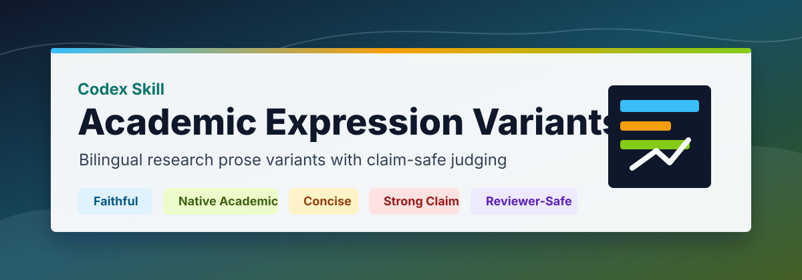
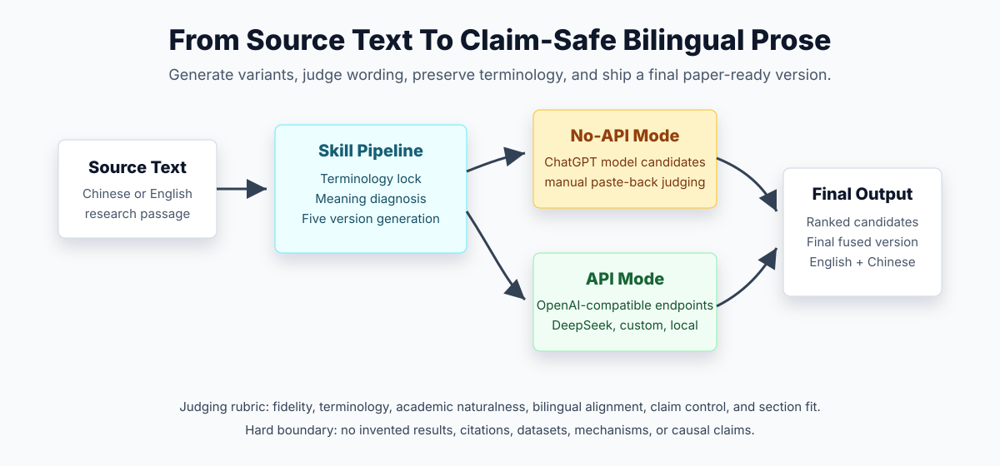

# Academic Expression Variants



`academic-expression-variants` is a Codex skill for turning Chinese or English research-paper text into multiple publication-quality academic expression variants. It is designed for researchers who need faithful translation, idiomatic scientific English, conservative reviewer-safe wording, and side-by-side Chinese verification.

The skill is especially useful for AI, recommender systems, multimodal learning, computer science, engineering, biomedical writing, social science writing, and other research-paper workflows where wording must be fluent but claims must remain defensible.

## What This Skill Does

Given a Chinese or English sentence, paragraph, abstract fragment, introduction paragraph, contribution statement, method description, result statement, or rebuttal text, the skill produces five default variants:

| Version | Purpose |
|---|---|
| Faithful | Preserve meaning, terminology, uncertainty, and claim scope as closely as possible. |
| Native Academic | Rewrite into natural, idiomatic research-paper prose. |
| Concise | Compress the expression for abstracts, highlights, captions, or contribution bullets. |
| Strong Claim | Make the contribution clearer and more confident without inventing evidence. |
| Reviewer-Safe | Use cautious, defensible wording for claims that may be scrutinized by reviewers. |

By default, every version includes:

- English: manuscript-ready academic English
- Chinese counterpart: aligned Chinese text for semantic verification
- Best for: where the version fits in a paper
- Risk note: meaning drift, overclaiming, ambiguity, or terminology concerns

## Key Features

- Bilingual output by default: English and Chinese counterparts are paired by version.
- Claim-safe rewriting: avoids unsupported novelty, causality, certainty, benchmark superiority, or broad generalization.
- Terminology preservation: locks domain terms, methods, datasets, variables, metrics, and hedges.
- Reviewer-risk awareness: flags wording that may overstate evidence or invite reviewer objections.
- No-API mode: lets users generate candidates in different ChatGPT models manually, then paste outputs back for rubric-based judging.
- Multi-model API mode: supports user-configured OpenAI-compatible endpoints such as OpenAI, DeepSeek, local gateways, and custom chat5.4/chat5.5-style services.
- Structured judging: evaluates candidates by fidelity, terminology, academic naturalness, bilingual alignment, claim control, and section fit.

## Workflow



## Example

User input:

```text
Use $academic-expression-variants to polish the following paragraph for an introduction section:

Multimodal recommendation aims to ...
```

Expected output shape:

| Version | English | Chinese counterpart | Best for | Risk note |
|---|---|---|---|---|
| Faithful | ... | ... | Initial translation | ... |
| Native Academic | ... | ... | Introduction/motivation | ... |
| Concise | ... | ... | Abstract or contribution | ... |
| Strong Claim | ... | ... | Strong problem framing | ... |
| Reviewer-Safe | ... | ... | Conservative wording | ... |

## Installation

Copy this folder into your Codex skills directory:

```powershell
Copy-Item -Recurse . "$env:USERPROFILE\.codex\skills\academic-expression-variants"
```

Or clone directly:

```powershell
git clone https://github.com/Wmhwxl/academic-expression-variants "$env:USERPROFILE\.codex\skills\academic-expression-variants"
```

Then invoke it in Codex:

```text
Use $academic-expression-variants to translate this Chinese research paragraph into five bilingual academic versions.
```

## No-API Mode

No-API mode is for users who do not have model API keys but still want multiple-model comparison.

Workflow:

1. Copy the candidate-generation prompt from `references/chatgpt-model-prompts.md`.
2. Run the same prompt in different ChatGPT models through the ChatGPT UI.
3. Paste the labeled outputs back into Codex.
4. The skill judges, ranks, rejects risky wording, and creates a final fused bilingual version.

This mode treats ChatGPT models as manual candidate generators and Codex as the final judge/editor.

## Multi-Model API Mode

The skill never provides or stores API keys. Users configure their own keys through environment variables or a local JSON config.

Built-in provider names:

- `openai`
- `deepseek`
- `custom_chat54`
- `custom_chat55`

Example:

```powershell
$env:DEEPSEEK_API_KEY = "your-key"

python scripts/run_multi_model.py `
  --input input.txt `
  --providers deepseek `
  --versions faithful,native,concise,strong,reviewer_safe `
  --output variants.json
```

Custom OpenAI-compatible endpoint:

```json
{
  "providers": {
    "my_model": {
      "base_url": "https://your-endpoint.example/v1",
      "api_key_env": "MY_MODEL_API_KEY",
      "model": "your-model-name"
    }
  }
}
```

Run:

```powershell
$env:MY_MODEL_API_KEY = "your-key"

python scripts/run_multi_model.py `
  --input input.txt `
  --config model-providers.json `
  --providers my_model `
  --output variants.json
```

## Directory Structure

```text
academic-expression-variants/
  SKILL.md
  agents/
    openai.yaml
  references/
    chatgpt-model-prompts.md
    field-style-notes.md
    no-api-mode.md
    prompt-architecture.md
    prompt-pack.md
    provider-config.md
    source-notes.md
    style-rubric.md
    version-types.md
  scripts/
    run_multi_model.py
```

## Design Principles

- Preserve factual content before improving style.
- Prefer defensible academic prose over promotional language.
- Keep English and Chinese outputs semantically aligned.
- Separate generation from judging in multi-model workflows.
- Do not treat a model name as proof of quality; judge the text itself.
- Do not fabricate citations, data, experiments, mechanisms, or results.

## Safety And Academic Integrity

This skill is intended for ethical academic editing, translation, polishing, and wording comparison. It should not be used to fabricate evidence, invent references, hide misconduct, evade institutional AI policies, or inflate unsupported scientific claims.

Users should follow the AI-use policies of their target journal, conference, university, or funder.

## License

Add a license file before making the repository public.
